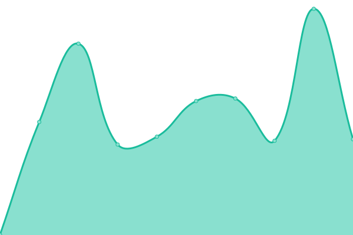

# [📈 Live Status](https://schubilab.github.io/up): <!--live status--> **🟩 All systems operational**

This repository contains the open-source uptime monitor and status page for [schubilab](https://schubilab.github.io/up), powered by [Upptime](https://github.com/upptime/upptime).

With [Upptime](https://upptime.js.org), you can get your own unlimited and free uptime monitor and status page, powered entirely by a GitHub repository. We use [Issues](https://github.com/schubilab/up/issues) as incident reports, [Actions](https://github.com/schubilab/up/actions) as uptime monitors, and [Pages](https://schubilab.github.io/up) for the status page.

<!--start: status pages-->
<!-- This summary is generated by Upptime (https://github.com/upptime/upptime) -->
<!-- Do not edit this manually, your changes will be overwritten -->
<!-- prettier-ignore -->
| URL | Status | History | Response Time | Uptime |
| --- | ------ | ------- | ------------- | ------ |
|  [Schubi-Lab](https://schubi-lab.de) | 🟩 Up | [schubi-lab.yml](https://github.com/schubi-lab/up/commits/HEAD/history/schubi-lab.yml) | 

 1013ms
     
 | 

<a href="https://schubi-lab.github.io/up/history/schubi-lab">100.00%</a>
    

|  [Blog](https://blog.schubi-lab.de) | 🟩 Up | [blog.yml](https://github.com/schubi-lab/up/commits/HEAD/history/blog.yml) | 

 445ms
     
 | 

<a href="https://schubi-lab.github.io/up/history/blog">100.00%</a>
    

|  [Authelia](https://auth.schubi-lab.de) | 🟩 Up | [authelia.yml](https://github.com/schubi-lab/up/commits/HEAD/history/authelia.yml) | 

 874ms
     
 | 

<a href="https://schubi-lab.github.io/up/history/authelia">100.00%</a>
    

<!--end: status pages-->

[**Visit our status website →**](https://schubilab.github.io/up)

## 📄 License

- Powered by: [Upptime](https://github.com/upptime/upptime)
- Code: [MIT](./LICENSE) © [schubilab](https://schubilab.github.io/up)
- Data in the `./history` directory: [Open Database License](https://opendatacommons.org/licenses/odbl/1-0/)
